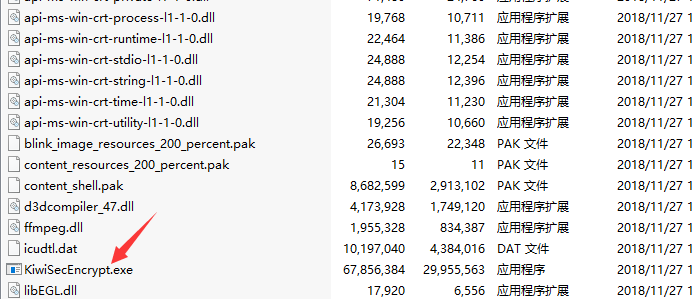
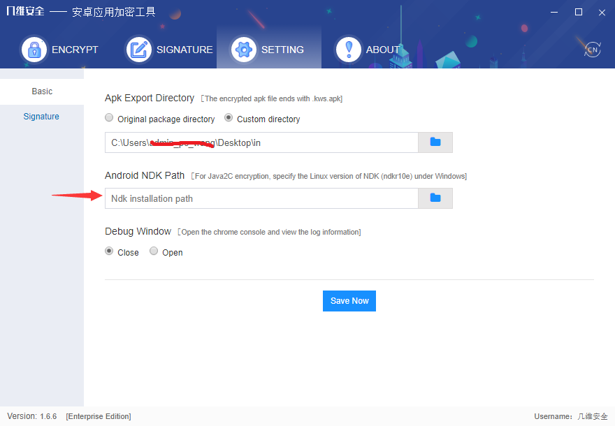
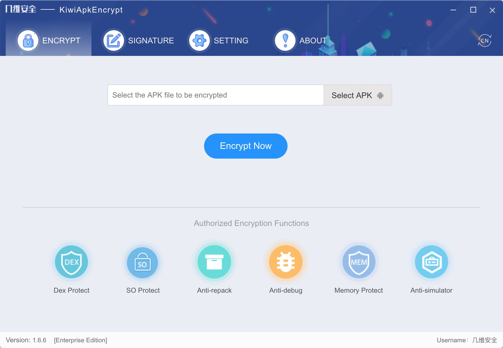
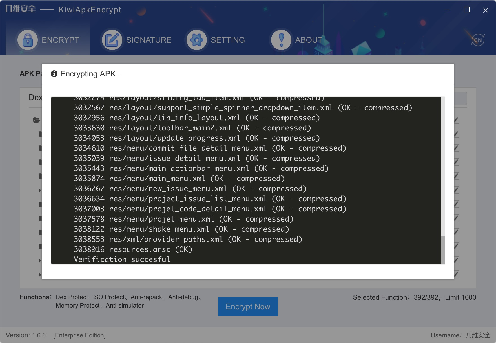
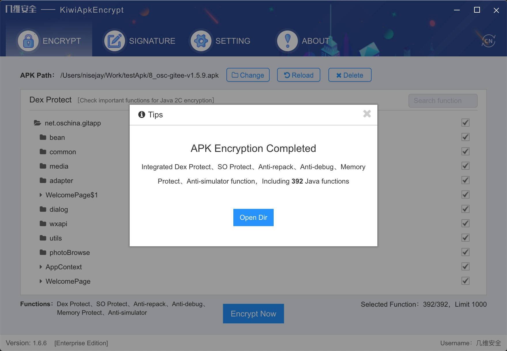

# [KiwiApkProtect](https://en.kiwisec.com/product/online-encrypt.html)  

KiwiApkProtect is an encryption service for mobile android applications that helps Internet companies and individual developers protect core technologies and intellectual property rights.Users only need to provide the packaged APK file, which can integrate DEX file encryption, SO file shell, anti-secondary packaging and other security functions.For different application security requirements, different levels of security protection functions can be provided, such as high-intensity security confrontation, you can choose to use Java2C, code confusion or KiwiVM .
 


## Features and Advantages
* **Dex Packer:** The Ultimate Packer for Dex file, prevent java code extraction by dex2jar.
* **Function Encryption:** Extracting java functions from Dex files for encryption protection.
* **Java2C Encryption:** Translate Java code into C code and implement the protection of the Native.
* **So Packer:** The Ultimate Packer for So file, to prevent reverse analysis by IDA tool.
* **Memory Protection:** Protect memory data from memory dump, tampering and other attacks.
* **Anti-debugging:** Prevent applications from being debugged by GDB and IDA tools
* **Anti-secondary Packaging:** Signature verification to prevent piracy applications.
* **Self Protection:** Protecting the program's own code with virtualization

## Introduction
Android app encryption is an encryption service for mobile android applications that helps Internet companies and individual developers protect core technologies and intellectual property rights.Users only need to provide the packaged APK file, which can integrate DEX file encryption, SO file shell, anti-secondary packaging and other security functions.For different application security requirements, different levels of security protection functions can be provided, such as high-intensity security confrontation, you can choose to use Java2C, code confusion or KiwiVM .

* **Risk summary:**
Decompilation DEX files, decompilation SO files, stealing core technologies, stealing sensitive data, implanting malicious viruses, tampering with copyright information, cracking authorization code, cracking communication protocols, secondary packaging and many other security risks.

* **Source of risk:**

| level | describe | distribution | advice |
| - | :- | :-: | :- |
| 1 | Use apktool, dex2jar, jd-gui, baksmali and other tools to directly obtain Java code | 99% |crypt the DEX file, or encapsulate the core code in the SO file |
| 2 | DexExtractor and other automatic extractor tools are used to extract Java code dynamically from memory data | 10% | Integrated memory protection, anti-debugging function, and use Java2c technology to convert Java code into C code, and SO shell protection |
| 3 | Repair ELF files, decompile the restored SO files using IDA tools, and analyze the core code logic | 2% | Protect SO files with code obfuscation encryption |
| 4 | Eliminate the obfuscation code in SO file and restore the original code automatically | 0.5% | Virtualization encryption protection for core code |
| 5 | Custom CPU instructions can be analyzed and the original CPU instructions can be automatically restored | 0.001% | Customize upgrade virtualization solutions |

* **Function introduction:**

| name | describe | Whether free |
| - | :-: | -: |
| DEX function encryption | The dynamic function of DEX file is extracted and encrypted, and the dynamic decryption is executed at runtime to protect Java code<br/>__［The free version encrypts only 20% of the functions randomly, while the enterprise version encrypts all dynamic functions］__ | Free/Paid |
| SO with shell protection |SO file for shell protection，Prevent reverse analysis| Paid |
| DLL whole shell | ［Unity mobile game］DLL file overall shell protection, prevent.net Reflector and other tools to decompile extraction C# code | Paid |
| DLL function encryption | ［Unity mobile game］Extract and encrypt functions of DLL files and perform dynamic decryption at runtime to prevent complete C# code from being dumped in memory | Paid |
| Anti-secondary packing | When the application runs, the signature file is dynamically verified. If the verification fails, it will exit to avoid the generation of pirated applications | Free |
| Memory protection | Prevents an attacker from tampering with or dumping sensitive data in memory | Paid |
| anti-debug  | Prevent an attacker from attaching a debugger to the running APP and maliciously analyzing the execution process of the code | Paid |
| Anti-system acceleration hook | ［Mobile game］Prevent malicious plug-ins from tampering with the time of the mobile phone system to make the accelerators and ensure the fairness of mobile game | Paid |
| SO confounding encryption | C, C++ code in SO file for confusing encryption protection<br/>  | Paid |
| Java2C - confusion | Convert Java code into C code through Java 2c technology, and implement code obfuscation protection for Native layer | Paid |


## Documentation
You can find the KiwiApkProtect documentation [on the website](https://document.kiwisec.com/en/kiwiApkEncrypt/offline-tool.html).  

#### Obtain
After purchasing the KiwiApkEncrypt, the key of the computer to be bound is extracted by the machine code generation tool provided by the Kiwisec. The Kiwisec will generate the corresponding KiwiApkEncrypt according to the Key, authorization time, authorized package name and enterprise information.

#### Install:
*  **At windows**

>Reliance on tools:Ubuntu.  
>System:Must be Windows 10 version 16215.0 or later  
>Processor architecture:X64

Configuration steps：
1. Enter the [Microsoft Store](https://aka.ms/wslstore).

2. Select and install Ubuntu, pay attention to system requirements.

3. Start Ubuntu directly or from the start menu and go to the command line window

4. Set UNIX user and password (default user name, can be switched to root via sudo su)

5. Execute: ```sudo dpkg --add-architecture i386``` add 32bit library support

6. Execute: `sudo apt update` update the source

7. Execute: `sudo apt install qemu-user-static openjdk-8-jre-headless python unzip lib32ncurses5-dev` Install dependent libraries

8. Execute `sudo update-binfmts --install i386 /usr/bin/qemu-i386-static --magic '\x7fELF\x01\x01\x01\x03\x00\x00\x00\x00\x00\x00\x00\x00\x03\x00\x03\x00\x01\x00\x00\x00' --mask '\xff\xff\xff\xff\xff\xff\xff\xfc\xff\xff\xff\xff\xff\xff\xff\xff\xf8\xff\xff\xff\xff\xff\xff\xff'`

9. Open the DOS command line and execute `ubuntu config --default-user root`，Switching the default user to root is especially important because the compiler cannot run otherwise

10. Unpack the android-ndk-r10e，unzip is recommended，Avoid affecting file permissions。Android NDK download address：https://github.com/android-ndk/ndk/wiki

11. install java8

* **MacOS and Linux** Install java8 and android-ndk-r10e.

#### Directions for use

1. After decompression tool kit, click on the directory ` KiwiSecEncrypt ` executable file to start tool, the following figure

 

2. The Windows version must specify the Android NDK path,  click the Settings button at the top as shown below

 

3. After selecting the APK file that needs to be encrypted, click the start encryption button to enter the pre-compilation stage. The following figure

 

4. Pre-compilation mainly analyzes DEX files to extract Java functions that can be converted into C. [the analysis stage takes several minutes, please wait patiently], as shown in the figure below

 

5. After the pre-compilation, according to the project situation, you can customize according to the project requirements, check the core code function, Java2C conversion. Memory protection, anti-debugging, anti-secondary packaging function default integration, temporarily can not be customized check, as shown in the figure below
 

6. After the custom check is completed, click  *Encrypt Now* . The encryption process takes several minutes. Please wait patiently. If this fails, troubleshoot the error log or send the log file to the technical support staff.
 

7. After encryption, click *Open Dir*  button to open the encrypted file location. The encrypted file name format is **.kws.apk**. If you need to modify the export directory, enter the Settings page.

 

8. To sign the encrypted apk file, you must use the same signature file as before the encryption, otherwise it will be regarded as piracy and cannot operate normally. It is suggested to check V2 version, which is more secure.

9. After signing, you can install, run and use it.

10. In case of any problem, please contact our customer service or technical support


## Introduce
Relying on the technical advantages of the team, KiwiSec focuses on next-generation technology and product development in mobile safety. After 8 years of accumulation in compiler security technology, and 3 years’ continuous research and development, the original KiwiVM virtual machine product has completely solved the problems of weak protection and poor compatibility inherent in traditional technologies such as hardening and obfuscation, providing a convenient and effective security solution.

[Learn more](https://en.kiwisec.com)

